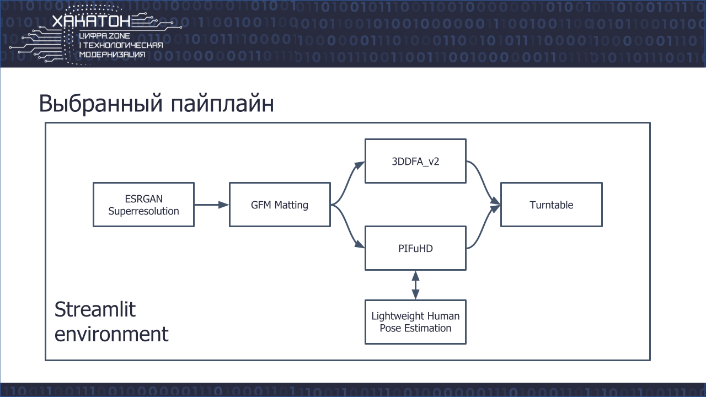
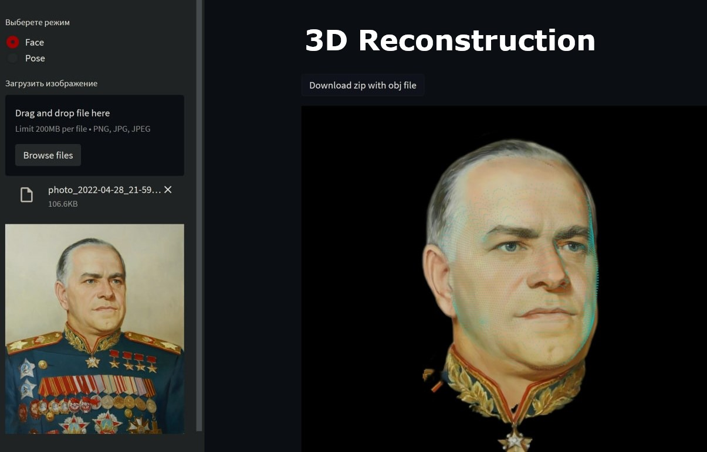

# 3D Reconstruction

Person's 2D to 3D shapes reconstruction



### Setup

To clone this repository and its submodules, run the following command:
```bash
git clone --recurse-submodules git@github.com:kadmus-dev/3d-reconstruction.git
```

If your submodule folders are empty, run:
```bash
git submodule init
git submodule update
```

To download models, run:
```bash
python3 deploy.py
```

To install dependencies, run:
```bash
pip install cython
pip install numpy
pip install -r requirements.txt
```

### Application

To start an application for user IO + 3D preview, run:
```
streamlit run app.py
```



### Running specific models

PIFuHD is run on all files inside input_directory and outputs results to output_directory
```bash
python run_pifu.py -i {input_directory} -o {output_directory}
```

3DDFA_V2 is run on all files inside input_directory and outputs results to output_directory
```bash
python run_3ddfa.py -i {input_directory} -o {output_directory}
```
